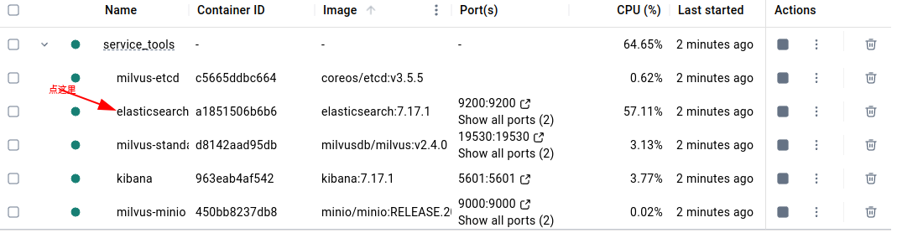
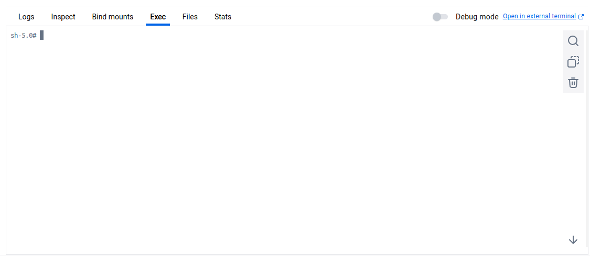

## Docker Environment Configuration

The default versions of various components used in the Docker environment, installed via `docker-compose.yml`.

### Default Versions

- **Docker**: 4.35.0  
- **Elasticsearch**: 7.17.1  
- **Kibana**: 7.17.1  
- **Milvus**: 2.4.0  
- **etcd**: 3.5.5  
- **MinIO**: RELEASE.2024-09-13T20-26-02Z  
- **Attu**: 2.4.0  
- **Neo4j**: 5.26.0
- **MySQL**: 5.7

### Notes

If the Docker version is too high (e.g., 4.38.0), Elasticsearch may encounter cgroup errors during startup.  
In this case, you can try upgrading Elasticsearch to version 7.17.26 by updating the `docker-compose.yml` file.

## 📌 Quick start
Create volume directories under the `docker` directory：
```bash
cd docker
mkdir -p elastic/data
mkdir -p milvus
mkdir -p neo4j
mkdir -p mysql/data
```
- Modify the `kibana.yml` file in the kibana folder and change the `elasticsearch.hosts` to your own IP address
- And change the password of elastic below to the password you want to set later (in the second step). (The default password is elastic).
Start Services
```bash
docker-compose up -d
```
This command will download and start the following containers:

- elasticsearch: For full-text search and document indexing
- milvus: For vector similarity search
- minio: For object storage
- etcd: For distributed key-value storage
- kibana: For elasticsearch visualization

All images will be downloaded to Docker's default image storage location (/var/lib/docker/). Total size ~2GB, may take 5-10 minutes depending on your network speed.

If the following words are displayed, it indicates that the download is complete.
```
[+] Running 11/11
⠿ Network docker_milvus-network   Created
⠿ Network docker_elastic-network  Created
⠿ Container milvus-minio          Started
⠿ Container milvus-etcd           Started
⠿ Container elasticsearch         Started
⠿ Container neo4j-container       Started
⠿ Container milvus-standalone     Started
⠿ Container kibana                Started
⠿ Container attu                  Started
⠿ Container adminer               Started
⠿ Container mysql                 Started

```
Check the service operation status
```bash
docker-compose ps
```
When you see output similar to this, all services have been successfully started, 
elasticsearch runs on port 9200, and milvus runs on port 19530:
```
NAME                IMAGE                                      COMMAND                  SERVICE             CREATED             STATUS                            PORTS
adminer             adminer                                    "entrypoint.sh docke…"   adminer             50 seconds ago      Up 30 seconds                     0.0.0.0:8080->8080/tcp
mysql               mysql:5.7                                  "docker-entrypoint.s…"   mysql               36 seconds ago      Up 4 seconds                      0.0.0.0:3306->3306/tcp, 33060/tcp 
attu                zilliz/attu:v2.4.0                         "docker-entrypoint.s…"   attu                36 seconds ago      Up 4 seconds                      0.0.0.0:8000->3000/tcp
elasticsearch       elasticsearch:7.17.1                       "/bin/tini -- /usr/l…"   elasticsearch       45 seconds ago      Up 35 seconds                     0.0.0.0:9200->9200/tcp, 0.0.0.0:9300->9300/tcp
kibana              kibana:7.17.1                              "/bin/tini -- /usr/l…"   kibana              36 seconds ago      Up 35 seconds                     0.0.0.0:5601->5601/tcp
milvus-etcd         quay.io/coreos/etcd:v3.5.5                 "etcd -advertise-cli…"   etcd                45 seconds ago      Up 35 seconds (healthy)           2379-2380/tcp
milvus-minio        minio/minio:RELEASE.2024-09-13T20-26-02Z   "/usr/bin/docker-ent…"   minio               45 seconds ago      Up 35 seconds (healthy)           0.0.0.0:9000-9001->9000-9001/tcp
milvus-standalone   milvusdb/milvus:v2.4.0                     "/tini -- milvus run…"   milvus-standalone   36 seconds ago      Up 4 seconds (health: starting)   0.0.0.0:9091->9091/tcp, 0.0.0.0:19530->19530/tcp
neo4j-container     neo4j:5.26.0                               "tini -g -- /startup…"   neo4j               45 seconds ago      Up 35 seconds                     0.0.0.0:7474->7474/tcp, 7473/tcp, 0.0.0.0:7687->7687/tcp


```

You need to enter the Elasticsearch container! (This is executed on Docker Desktop. You can also use the terminal to enter the Docker container for operations.)
 



Enter the command in the exec in its container:

```sh
bin/elasticsearch-setup-passwords interactive
```

Change the password. There should be 5-6 users who need to change their passwords. It is recommended to change them all to the same.(I changed all the passwords to "elastic" for consistency.)

The configuration is completed. Open the kibana container (or just wait without opening it). The interface will output kibana is available to enter port 5601. It can be used.

# About Ports

Here is a list of the ports used by each service:

| Service       | Front-end Port | Read/Write Port |
|---------------|----------------|-----------------|
| Elasticsearch | 5601           | 9200            |
| Milvus        | 8000           | 19530           |
| Neo4j         | 7474           | 7687            |
| MySQL         | 8080           | 3306            |


